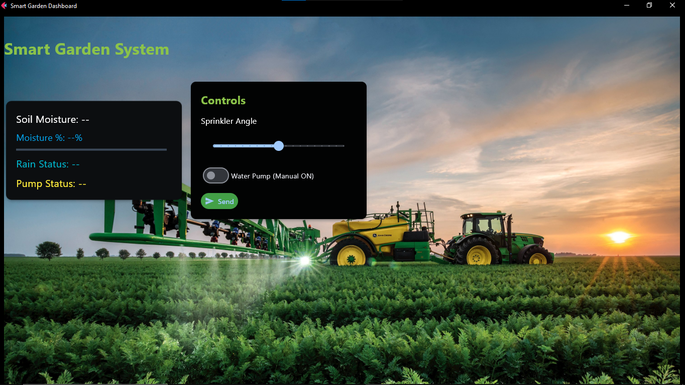
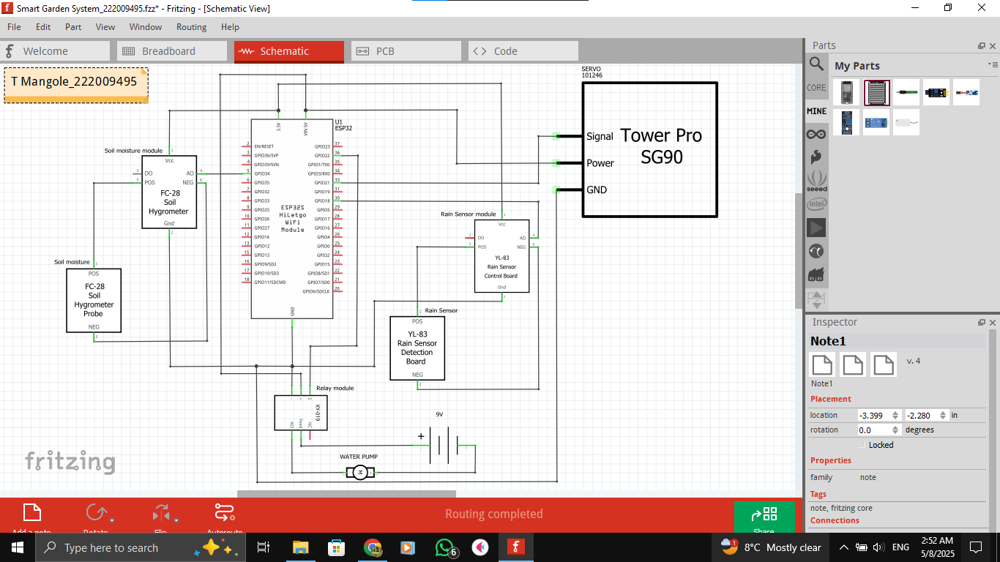
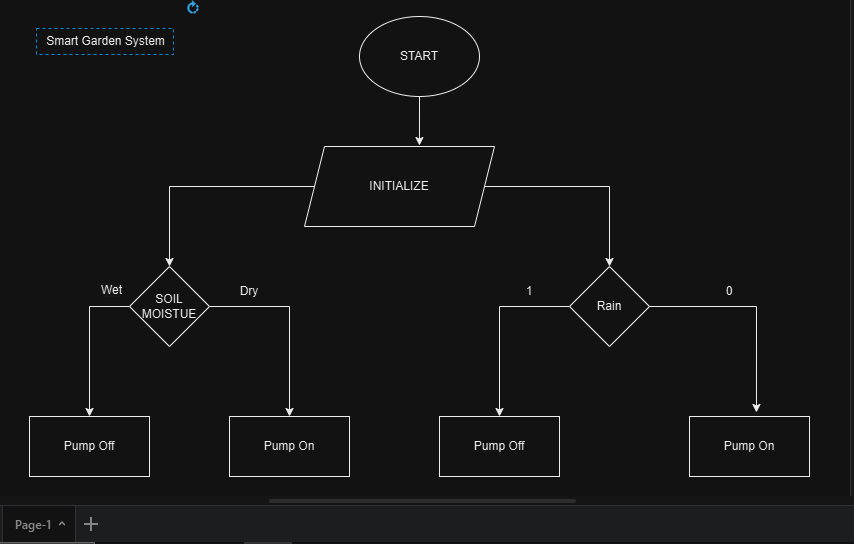

System Overview
The Smart Garden System automates plant watering based on environmental conditions. It includes:

ESP32 Microcontroller: Reads soil moisture and rain sensors, controls the water pump and sprinkler servo.

Flask Backend: Stores sensor readings, manages control logic, and exposes REST APIs.

Flet Frontend: Displays real-time data and allows users to manually control the pump and sprinkler angle.

Dual Mode Operation:

Auto: Waters only when soil is dry and it's not raining.

Manual: User can override and control the system via dashboard.

Screenshots
Flet Dashboard UI

System Schematic Diagram

Flowchart

 Folder Structure
smart-garden-system/
├── application/esp32_code/esp32.py    # MicroPython code for ESP32
├── flask_app/app.py                   # Flask backend server
├── flet_app/main.py                   # Flet frontend dashboard
└── assets/farm.jpg                    # Images Background UI
├── project_docmentation               # Images for schematic, Full UI, flowchart
├── github_repo.txt
├── requirements.txt                   # Python dependencies
├── video_link.txt                     # Youtube video link
└── README.md                          

System Components

Component	Description
ESP32	WiFi-enabled microcontroller running MicroPython
Soil Sensor	Analog moisture sensor (0-4095)
Rain Sensor	Digital rain sensor (Active LOW)
Water Pump	Controlled by GPIO Relay
Servo Motor	Controls sprinkler spray angle (0°–180°)
WiFi Network	For connecting ESP32 and server
Flask App	Backend API and logic
Flet Dashboard	Visual frontend with live updates

Setup Instructions
1. Backend (Flask)
pip install flask flask-cors
python app.py
Running at http://<my-PC-ip>:5000.

2. ESP32 MicroPython Setup
Flash MicroPython to your ESP32.

Use mpremote to upload esp32_controller.py.

Edit the following in the script:

SSID = "A15"
PASSWORD = "12345678"
BACKEND_HOST = "http://127.0.0.1:5000"
Run the script on boot with boot.py or execute manually in CMD using mpremote.

3. Frontend (Flet UI)
Install dependencies and run:
pip install flet requests
python dashboard.py
System Workflow
Microcontroller (ESP32)
Reads:

Soil Moisture (ADC)

Rain (digital input)

Sends readings to POST /data

Gets control state from GET /control

Acts accordingly:

Auto: Turns pump ON if soil is dry

Manual: Responds to user override

Adjusts sprinkler angle via servo

Backend (Flask)
Receives sensor data

Stores state

Returns control settings to ESP32

Implements auto logic:

If rain is detected, pump is disabled

If moisture % < threshold, pump is enabled

Exposes:

GET /status (for frontend)

GET/POST /control (for manual mode)

Frontend (Flet)
Displays live:

Moisture level (raw and %)

Rain status

Pump status

Allows user to:

Toggle manual ON/OFF

Adjust sprinkler angle

Send settings to backend

API Endpoints
Method	Endpoint	Description
POST	/data	Receives sensor data
GET	/control	Fetch current control state
POST	/control	Update manual control settings
GET	/status	Returns latest sensor + control

Control Logic Summary
Mode	Pump Logic	Notes
Auto	ON if soil is dry AND no rain	Based on moisture threshold
Manual	User toggles ON/OFF via dashboard	Overrides auto behavior

Future Improvements
Add temperature/humidity sensors

Use cloud backend for remote access

Add push notifications/reminders

Host dashboard as a web app

Add authentication to control panel

Requirements
Tool	Version
Python	3.9+
Flet	latest
Flask	2.x
ESP32	MicroPython firmware

Testing Tips
Simulate dry/wet conditions by adjusting soil sensor voltage.

Use water drops to test rain sensor.

Use the Flet UI to switch between modes and see live updates.

Author
Tumelo Mangole – System Architect & Developer

Powered by ESP32, Flask, Flet, and MicroPython

Assets Reminder
Place these in the assets/ directory:

dashboard_ui.png – Screenshot of the Flet UI

schematic.png – Wiring diagram showing sensor & pump setup

flowchart.png – System data flow/decision logic

